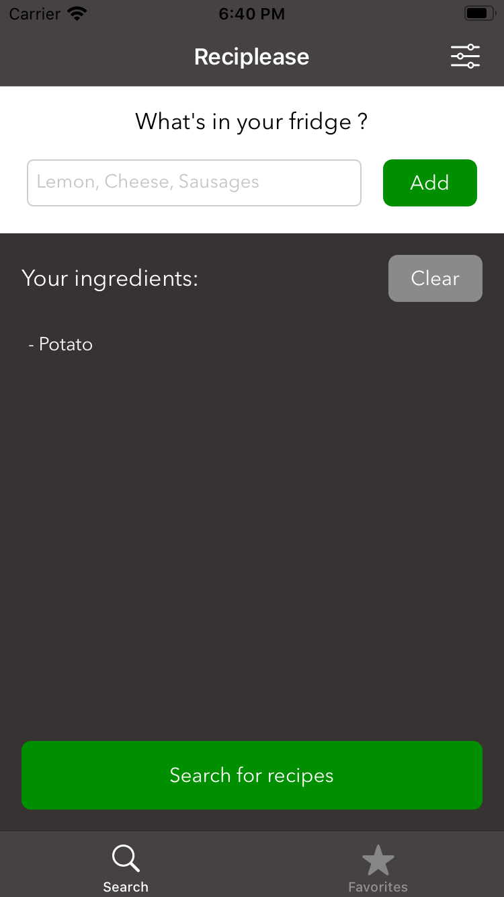
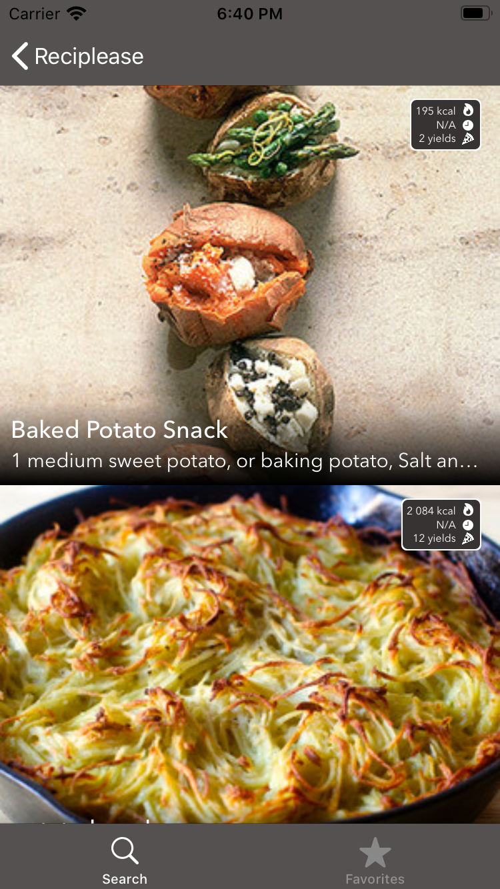
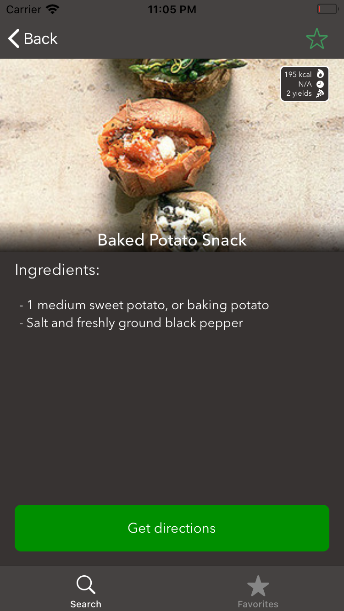
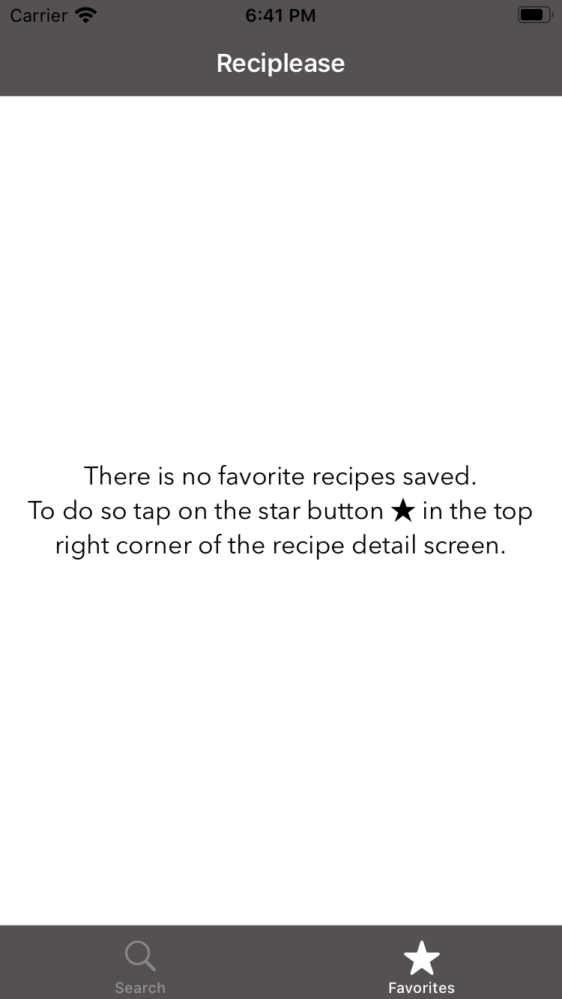
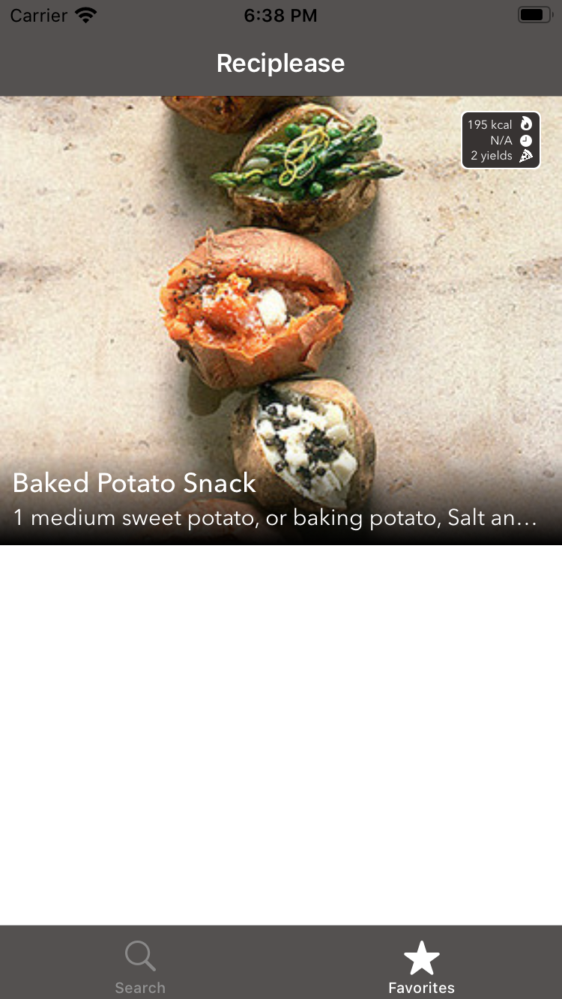
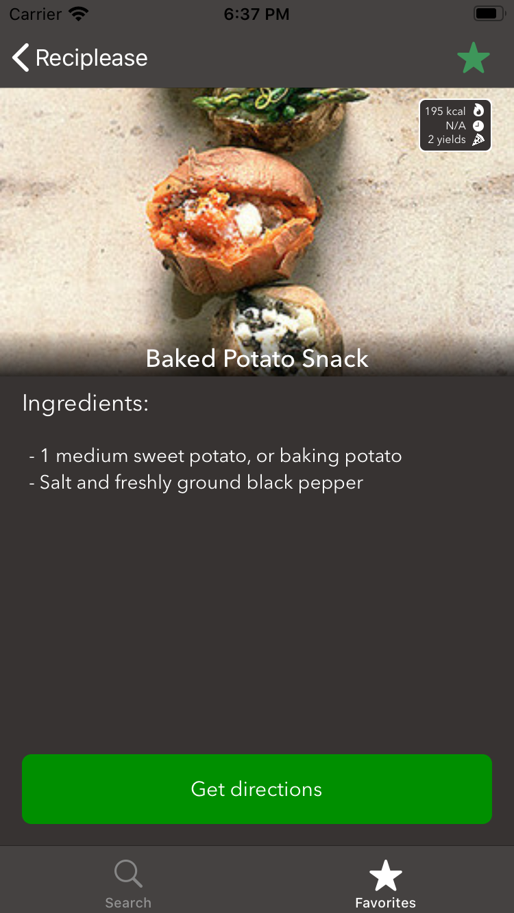
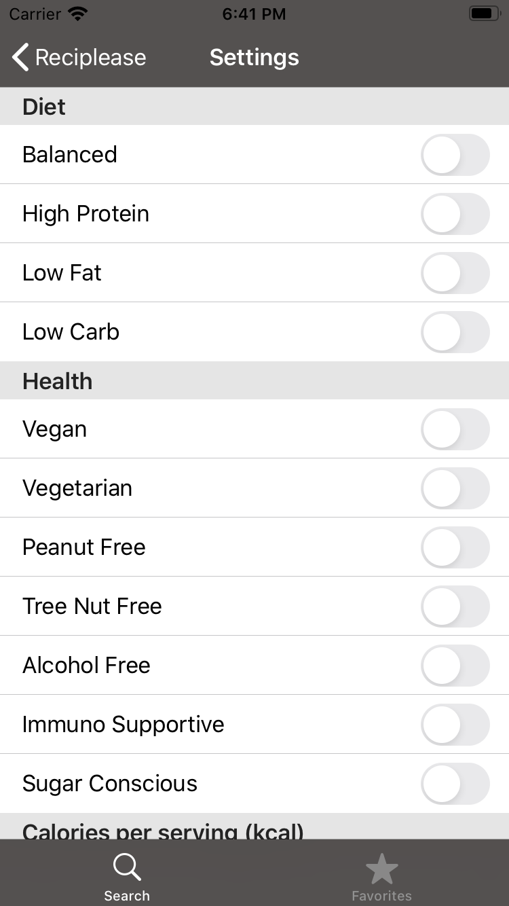
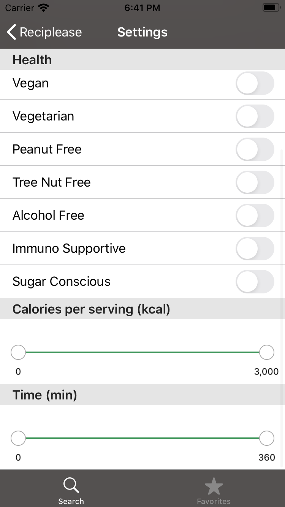

# Reciplease
This project is the tenth of the iOS Developer path from OpenClassrooms. [See demo](https://www.youtube.com/watch?v=vUSXFOXbMrU).  
Reciplease allows you to search for recipes based on ingredients. You can also keep your favorite recipes as favorites.   
The application is therefore divided into two parts: research and favorites. You can navigate between the two parts thanks to a Tab bar.

This app is:

- responsive in all iPhones in portrait mode,
- dependent on Alamofire, CoreData and the [Edamam API](https://developer.edamam.com/edamam-docs-recipe-api),
- managed by CocoaPods,
- conform to MVC,
- covered by unit tests.

## Search
  

## Favorites
  

## Settings
 
